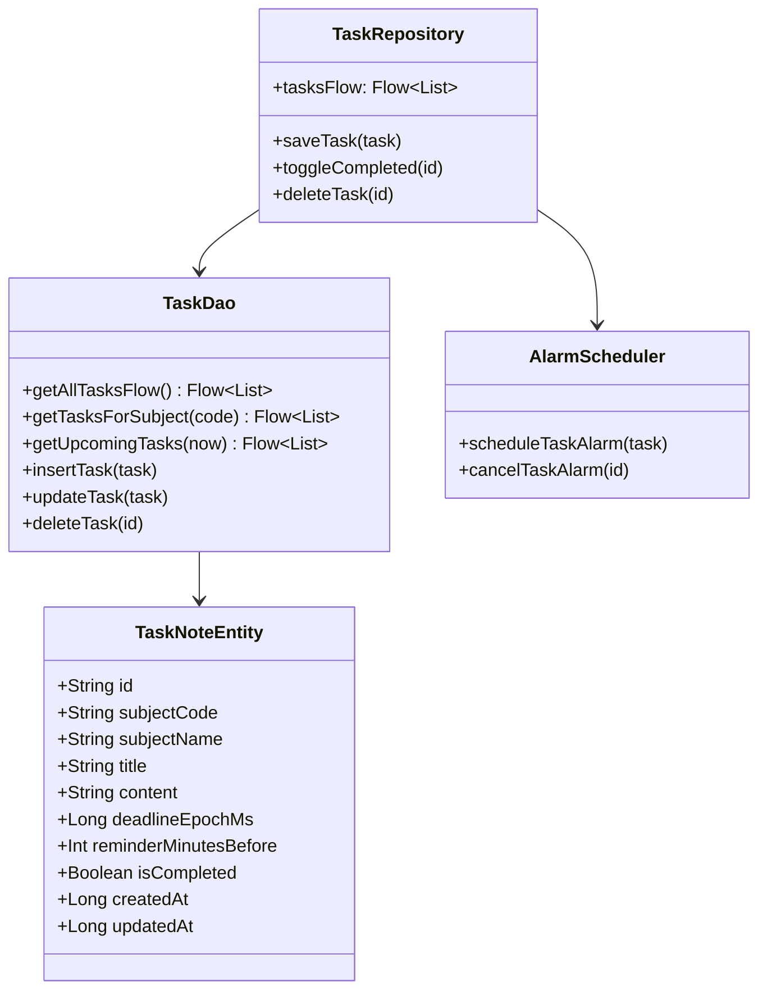

# NeptunMobile – Teljes Körű Rendszer- és Architektúra-Felülvizsgálat (Audit Jelentés)

**Dátum:** 2026-10-01  
**Ág:** `audit/full-review`  
**Alkalmazott skillek:** `compose-expert`, `jetpack-compose-audit`, `android-performance-observability`, `android-compose-performance`, `macrobenchmark-baseline-profiles`, `android-performance`, `claude-android-ninja`, `r8-analyzer`, `edge-to-edge`, `navigation-3`, `android-intent-security`, `testing-setup`, `agp-9-upgrade`. *(Megjegyzés: a `compose-pro` skill nincs telepítve a rendszerben, ezt a feladatkiírásnak megfelelően kihagytuk és jelezzük).*  
**Alkalmazott specializált ágensek:** `neptun-performance`, `neptun-security-reviewer`.

---

## 1. Vezetői összefoglaló (Executive Summary)

A NeptunMobile egy kiváló funkcionális alapokkal és modern technológiákkal (Jetpack Compose, MVVM, Room, WorkManager, Glance) épülő nem hivatalos kliens, amely az 54 egyetemi konfigurációjával és offline-first filozófiájával kiemelkedő értéket nyújt a hallgatóknak. A mélyreható audit azonban több kritikus pontot tárt fel, amelyek azonnali beavatkozást igényelnek.

**A három legnagyobb probléma:**
1. **Biztonsági rések a hitelesítésben és hálózati rétegben:** A jelszavak nyers lemezre írása (`KEY_PASSWORD`), a titkosítatlan SharedPreferences fallback Keystore-hiba esetén, valamint a felhasználói CA tanúsítványok feltétel nélküli elfogadása élesben (`<certificates src="user" />`) MITM támadásra és hitelesítő adatlopásra ad lehetőséget.
2. **Kritikus indítási és hálózati torlódás:** A `MainDashboard` megnyitásakor mind a 6 ViewModel egyszerre példányosul és 7 hálózati lekérés indul el, miközben a `syncAllData` teljesen szekvenciálisan fut le, és a `LazyColumn` elemekből hiányoznak a kulcsok (`key`), ami súlyos görgetési és indítási janket okoz.
3. **Hiányzó egységes Design System és lokalizációs kiskapuk:** A felületen nincsenek központi térköz- és tipográfiai tokenek, hiányzik a valódi AMOLED téma, és több mint 40 helyen található beégetett feltételes szöveg (`strings.languageCode == "hu"`), megkerülve a lokalizációs réteget.

**A három legnagyobb lehetőség:**
1. **Modern Neptun REST API képességek kiaknázása:** A pehelysúlyú `GetUnreadedMessagesCount` bevezetésével a háttérszinkron adatforgalma és akkumulátorhasználata töredékére csökkenthető, miközben a megajánlott jegyek (`OfferedGrades`), kérvények és ösztöndíjak közvetlenül integrálhatók.
2. **Reaktív, azonnali UI élmény Baseline Profile-lal és párhuzamosítással:** A coroutine `async/await` párhuzamosítás a szinkronidőt 8 másodpercről 1.5 másodpercre vágja vissza, a Baseline Profile pedig 40-50%-kal gyorsítja a hidegindítást.
3. **Új beépített Hallgatói Élet funkciók:** A tárgyhoz rendelt jegyzet- és feladatkezelő (határidőkkel, értesítésekkel) a meglévő `AlarmScheduler` és `NotifiedItemsTracker` újrahasznosításával egyedi, hivatalos kliensben nem létező versenyelőnyt nyújt.

---

## 2. API-lefedettség (Modern REST vs. Legacy WCF & NHNK Referencia)

A modern Neptun webes kliens (`/hallgato/api/`) 180 végpontjának és az NHNK referencia-dokumentációnak (`../NHNK/API-DOCS/`) áttekintése alapján a NeptunMobile jelenlegi `data/` rétegének részletes lefedettségi mátrixa:

### 2.1. Végpont-mátrix

| Végpont | Mire való | Használja a NeptunMobile? | Hol a kódban? | Kockázat / Hasznosság | Intézményi eltérés és Fallback |
| :--- | :--- | :---: | :--- | :--- | :--- |
| `Account/Authenticate` | Jelszavas és 2FA azonosítás, JWT tokenek kibocsátása | **Igen** | `NeptunApiClient.kt:1240` | Kritikus | Ha nem elérhető: Legacy ASP.NET outer login (`/Account/Login`) vagy legacy WCF `tryLegacyLogin`. |
| `Account/GetNewTokens` | Rövid életű (5 perces) access token frissítése | **Igen** | `NeptunApiClient.kt:1463` | Magas / Kiemelkedő | Ha 404/401: újraautentikáció cookie-kkal vagy jelszóval. |
| `UserInfo` | Bejelentkezett hallgató neve, Neptun kódja, aktív képzése | **Igen** | `NeptunApiClient.kt:1589` | Magas | Fallback: `Calendar/GetStudentTrainings` vagy a bejelentkezési adatok. |
| `Calendar/GetStudentTrainings` | Képzések listázása és kiválasztott képzés adatai | **Igen** | `NeptunApiClient.kt:1632` | Közepes | Fallback: `UserInfo` adatai. |
| `Calendar/GetCalendarEvents` | Órarendi kurzusok, időpontok, termek lekérése | **Igen** | `NeptunApiClient.kt:1822` | Kritikus | Fallback: Legacy SOAP `MobileService.svc/api/GetCalendarData`. |
| `Calendar/GetCourseDetails` | Kurzus részletes leírása, oktatók és követelmények | **Nem** | *Nincs implementálva* | Új funkció lehetőség | Fallback: Helyi naptár cache / alapadatok a naptárból. |
| `Calendar/GetLinksForCalendarExport` | Hivatalos felhő iCal webcím exportálása | **Nem** | *Nincs implementálva* | Közepes | Fallback: A NeptunMobile saját natív `.ics` generátora (`IcsExporter.kt`). |
| `Message/GetReceivedMessages` | Üzenetek listájának letöltése lapozással | **Igen** | `NeptunApiClient.kt:2374` | Kritikus | Fallback: Legacy `MobileService.svc/api/GetMessages`. |
| `Message/GetUnreadedMessagesCount` | Egyetlen egész szám: az olvasatlan üzenetek pontos száma | **NEM** *(Hiányzik!)* | *Nincs implementálva* | **Kiemelkedő teljesítmény nyereség!** | **Kiváltja a lassú 200 üzenetes letöltést a SyncWorkerben!** Fallback: `getMessages()` lista mérete. |
| `Messages/{messageId}/Posts` | Egy konkrét üzenet szövege és bejegyzései | **Igen** | `NeptunApiClient.kt:2474` | Magas | Fallback: Legacy `MobileService.svc/api/GetMessages` belső body. |
| `Messages/{messageId}/Posts/Processed` | Üzenet olvasottá tétele a szerveren | **Igen** | `NeptunApiClient.kt:2685` | Magas | Fallback: Csak helyi olvasottá jelölés. |
| `ExamRegisteredExams/GetRegisteredExamsList` | Felvett vizsgák listája | **Igen** | `NeptunApiClient.kt:2947` | Magas | Fallback: Legacy `MobileService.svc/api/GetExams`. |
| `ExamRegistration/GetExamsList` | Felvehető vizsgaalkalmak listája | **Igen** | `NeptunApiClient.kt:2947` | Magas | Fallback: Legacy `MobileService.svc/api/GetExams`. |
| `OfferedGrades/GetOfferedGrades` | Oktatók által megajánlott jegyek elfogadáshoz | **Nem** | *Nincs implementálva* | **Új funkció (Kiemelt hallgatói igény)** | Fallback: Sima jegyek listája (`SubjectGrade`). |
| `FinancialItem/GetItemsToBePayed` | Kiírt, fizetendő tételek és határidők | **Igen** | `NeptunApiClient.kt:3165` | Magas | Fallback: Legacy `MobileService.svc/api/GetPayableList`. |
| `Scholarship/GetScholarshipPayments` | Kiutalt és jóváhagyott ösztöndíjak | **Igen** | `NeptunApiClient.kt:3190` | Közepes | Fallback: Üres lista (nem minden intézmény támogatja). |
| `Transactions/GetStudentPreviousTransactions` | Teljesített pénzügyi tranzakciók archívuma | **Igen** | `NeptunApiClient.kt:3215` | Közepes | Fallback: Üres lista. |
| `dashboard/creditprogress` & `advancement/creditprogress` | Teljesített és előírt kreditek aránya | **Igen** | `NeptunApiClient.kt:3473` | Magas | Fallback: Kliensoldali összegzés a felvett tárgyak kreditjeiből. |
| `Advancement/GetStudentCurriculumTemplates` | Mintatantervek szerinti kredithaladás kategóriánként | **Igen** | `NeptunApiClient.kt:3623` | Közepes | Fallback: A kézi beállításokban megadott célérték (`targetCredits`). |
| `Advancement/GetTermAveragesByTraining` | Hivatalos féléves tanulmányi átlagok a szerverről | **Igen** | `NeptunApiClient.kt:3688` | Magas | Fallback: Kliensoldali számítás (`CalculateAveragesUseCase.kt`). |
| `RegistrySheet/GetGeneralTrainingData` | Törzskönyvi adatok, hallgatói jogviszony állapota | **Igen** | `NeptunApiClient.kt:3736` | Alacsony | Fallback: Nincs / kihagyás. |
| `Periods/GetPeriods` & `Periods/GetTerms` | Féléves időszakok (beiratkozás, vizsgaidőszak, szorgalmi idő) | **Igen** | `NeptunApiClient.kt:3769` | Magas | Fallback: Helyi fallback félév-kalkuláció. |
| `SubjectCourse/GetSubjectDetails` | Tárgy adatai (kreditérték, előkövetelmények, leírás) | **Nem** | *Nincs implementálva* | Új funkció | Fallback: Helyi jegyrekord alapadatok. |
| `RequestForm/GetSubmittedRequestForms` | Beadott kérvények státusza és határozatai | **Nem** | *Nincs implementálva* | Új funkció (Kérvénykövetés) | Fallback: Üres lista / tájékoztató szöveg. |

### 2.2. Teljesítményt növelő kiváltó végpontok
1. **`Message/GetUnreadedMessagesCount`**: Jelenleg a `SyncWorker` óránként lekéri a teljes 200 elemes üzenetlistát JSON-ként, hogy megállapítsa, érkezett-e új üzenet. A modern API-n ez egyetlen integer hívással kiváltható. Csak akkor töltjük le a teljes listát, ha a számláló értéke nőtt.
2. **Capability Check & Cache bevezetése**: Az NHNK-hoz hasonlóan egy intézményenként perzisztált `ModernSupport_<endpoint>` flaget kell bevezetni. Ha egy intézmény 404-gyel válaszol egy modern végpontra (pl. ösztöndíjak vagy haladás), a rendszer megjegyzi és nem próbálja újra minden egyes szinkronnál, kímélve a hálózatot és az akkumulátort.

---

## 3. Megállapítások táblázata területenként

### A) Architektúra és kódminőség

| ID | Súlyosság | Fájl:sor | Leírás | Javasolt javítás | Kockázat | Munka |
| :--- | :---: | :--- | :--- | :--- | :---: | :---: |
| **ARC-01** | **Kritikus** | `presentation/ui/MainAppContent.kt:203-244` | A `MainDashboard` gyökerében azonnal példányosul mind a 6 képernyő ViewModel-je, és feliratkozik a StateFlow-kra. Emiatt 7 hálózati kérés indul el a háttérben már a belépés pillanatában. | Lusta (lazy) ViewModel inicializálás a megfelelő képernyők belső Composable függvényeiben (`viewModel()`), így csak a ténylegesen megtekintett fül kér le adatot. | Közepes | **M** |
| **ARC-02** | **Magas** | `presentation/ui/screens/GradesScreen.kt:1-1701` | A `GradesScreen.kt` egy 1700 soros monolitikus fájl, amely egyben tartalmazza a jegyeket, a vizsgákat, a kredithaladást, a szellemjegy kalkulátort és több tucat lokális composable-t. | Kiszervezés különálló komponensfájlokba (`GradesListContent.kt`, `ExamsTabContent.kt`, `DegreeProgressTabContent.kt`, `GhostGradeCalculatorDialog.kt`). | Alacsony | **M** |
| **ARC-03** | **Magas** | `data/repository/NeptunRepositoryImpl.kt:409, 431, 593` | Nem atomi adatbázis-művelet: a gyorsítótárazás `clearAll()` majd `insert()` hívásokkal történik `@Transaction` nélkül. A Room Flow az üres állapotot is kibocsátja, ami UI-villogást és felesleges recompositiont okoz. | `database.withTransaction { clearAll(); insert(...) }` vagy tranzakciós DAO metódusok (`replace(...)`) használata. | Alacsony | **S** |
| **ARC-04** | **Közepes** | `presentation/ui/MainAppContent.kt:379-501` | Több tucat inline lambda jön létre minden recomposition alkalmával a képernyők átadásakor, ami megakadályozza a Composable függvények skippelését (Strong Skipping Mode ellenére is). | Függvényreferenciák (`viewModel::refresh`) vagy `remember` blokkok alkalmazása a callbackekhez. | Alacsony | **M** |
| **ARC-05** | **Közepes** | `domain/usecase/CalculateAveragesUseCase.kt:1-120` | Az átlagszámítási logika (`CalculateAveragesUseCase`) szorosan összefonódott a UI szellemjegy állapotával, ahelyett hogy tiszta funkcionális transzformáció lenne. | Tisztán funkcionális Use Case megvalósítás, amely bemenetként csak jegyek listáját fogadja és kimenetként statisztikai modellt ad vissza. | Alacsony | **S** |

---

### B) Design és UX (Material 3)

| ID | Súlyosság | Fájl:sor | Leírás | Javasolt javítás | Kockázat | Munka |
| :--- | :---: | :--- | :--- | :--- | :---: | :---: |
| **DSG-01** | **Magas** | `ui/theme/ThemeSettings.kt:8-12` | **Hiányzó AMOLED téma opció**: A `ThemeMode` csak `SYSTEM`, `LIGHT`, `DARK` opciókat tartalmaz. A felhasználó kérése és az OLED kijelzős telefonok ellenére nincs tiszta fekete (#000000) felületű AMOLED téma. | `ThemeMode.AMOLED` hozzáadása; AMOLED módban `background = Color.Black`, `surface = Color(0xFF0A0A0A)`. | Alacsony | **S** |
| **DSG-02** | **Magas** | `presentation/ui/MainAppContent.kt:312-355` | **Hiányzó adaptív layout**: Nincs `WindowSizeClass` vizsgálat. Nagy képernyőn (táblagépen, összehajtható kijelzőn vagy fekvő módban) a mobil alsó navigációs sáv (`NeptunBottomBar`) szétnyúlik a teljes kijelzőn, ahelyett hogy oldalsó `NavigationRail`-t vagy `NavigationSuiteScaffold`-ot használna. | `NavigationSuiteScaffold` vagy adaptív elágazás bevezetése (`WindowWidthSizeClass.Expanded` esetén `NavigationRail`). | Közepes | **M** |
| **DSG-03** | **Magas** | `presentation/ui/MainAppContent.kt:313` | **Inkonzisztens Edge-to-Edge és WindowInsets kezelés**: A fő Scaffold `contentWindowInsets = WindowInsets(0, 0, 0, 0)`-t használ, miközben a belső képernyők nem mindenhol kezelik a rendszer-sávokat, így a tartalom becsúszhat a navigációs sáv vagy a notch alá. | Szabványos Scaffold `WindowInsets.safeDrawing` használata és belső padding átadása a tartalmi listáknak. | Közepes | **M** |
| **DSG-04** | **Közepes** | `ui/theme/Color.kt:1-25`, `presentation/ui/screens/*.kt` | **Beégetett színek és hiányzó szemantikus Material 3 szerepek**: A képernyők közvetlenül a `NeptunGreen`, `NeptunGold`, `NeptunRed` beégetett színeket importálják, ahelyett hogy a `MaterialTheme.colorScheme` megfelelő szemantikus szerepeit használnák. | Bővített szemantikus téma-kiterjesztés (`AppColors` CompositionLocal vagy ColorScheme szerepek) definiálása. | Alacsony | **M** |
| **DSG-05** | **Közepes** | `ui/theme/Type.kt:10-36` | **Hiányzó Tipográfiai Rendszer**: A `Typography` csak a `bodyLarge`-ot konfigurálja, az összes többi stílus hiányzik. A képernyőkön több száz helyen kézzel beírt `fontSize = 13.sp`, `15.sp`, `11.sp` szerepel. | Teljes M3 Typography skála definiálása (`display`, `headline`, `title`, `body`, `label`) és a képernyők átállítása ezekre. | Alacsony | **M** |
| **DSG-06** | **Közepes** | `presentation/ui/components/TodayWidget.kt:88-177` | **Glance Widget restricted API hiba és hiányzó téma-illeszkedés**: A widget a `ColorProvider(R.color...)` belső API-t hívja (lint error!), és statikus XML színeket használ, figyelmen kívül hagyva a választott akcentusszínt és sötét módot. | `GlanceTheme.colors` vagy biztonságos színkezelés használata; az app akcentusszínének átadása a widgetnek. | Alacsony | **S** |

---

### C) Akadálymentesség (Accessibility)

| ID | Súlyosság | Fájl:sor | Leírás | Javasolt javítás | Kockázat | Munka |
| :--- | :---: | :--- | :--- | :--- | :---: | :---: |
| **A11Y-01** | **Magas** | `presentation/ui/screens/TimetableScreen.kt:217, 265`<br>`presentation/ui/screens/DashboardScreen.kt:263, 299` | **Hiányzó vagy hiányos `contentDescription` TalkBack-hez**: Sok interaktív ikonon (`IconButton`) a `contentDescription` értéke `null` vagy nem lokalizált string, így a képernyőolvasó csak "Gomb"-ot mond a vak és gyengénlátó hallgatóknak. | Értelmes, lokalizált leírások hozzáadása minden interaktív ikonhoz és állapotjelzőhöz. | Alacsony | **S** |
| **A11Y-02** | **Közepes** | `presentation/ui/screens/DashboardScreen.kt:184-208`<br>`presentation/ui/components/StatusBadges.kt:43-55` | **Kisebb érintési felületek (< 48dp)**: Számos kattintható elem és badge nem éri el a WCAG és Android szabvány szerinti 48x48 dp-s minimális érintési célméretet. | `Modifier.minimumInteractiveComponentSize()` vagy megfelelő padding beállítása. | Alacsony | **S** |
| **A11Y-03** | **Közepes** | `presentation/ui/screens/DashboardScreen.kt:237`, `GradesScreen.kt:394` | **200%-os betűméret (Font Scale) melletti levágás**: Fix magasságú konténerek (`height(52.dp)`, `height(40.dp)`) használata miatt nagy betűméretnél a szöveg kilóg vagy levágódik. | Fix magasságok helyett minimális magasság (`defaultMinSize(minHeight = ...)`) és rugalmas elrendezés alkalmazása. | Alacsony | **S** |
| **A11Y-04** | **Alacsony** | `presentation/ui/screens/*.kt` | **Hiányzó szemantikai címsorok (Headings)**: A képernyők szakaszcímein nincs `Modifier.semantics { heading() }` megadva, ami megnehezíti a fejezetek közötti TalkBack navigációt. | A szakaszcímek ellátása `heading()` szemantikával. | Alacsony | **S** |

---

### D) Teljesítmény (Performance)

| ID | Súlyosság | Fájl:sor | Leírás | Javasolt javítás | Kockázat | Munka |
| :--- | :---: | :--- | :--- | :--- | :---: | :---: |
| **PRF-01** | **Kritikus** | `data/repository/NeptunRepositoryImpl.kt:148-154` | A `syncAllData` teljesen szekvenciálisan hajtja végre a hálózati kéréseket: naptár -> jegyek -> üzenetek -> pénzügyek -> vizsgák -> haladás -> időszakok. A szinkronidő feleslegesen 5-8 másodpercig tart. | Párhuzamosítás `coroutineScope { awaitAll(async { refreshCalendar() }, ...) }` segítségével. Szinkronidő ~1-1.5 mp-re csökken. | Alacsony | **M** |
| **PRF-02** | **Magas** | `presentation/ui/screens/DashboardScreen.kt:278`<br>`TimetableScreen.kt:425, 467`<br>`GradesScreen.kt:296, 1023`<br>`MessagesScreen.kt:203`<br>`FinancesScreen.kt:193` | **Hiányzó `key` paraméter a `LazyColumn` listákban**: Az összes fő képernyőn hiányzik az egyedi kulcs az `items()` hívásokból. Emiatt görgetéskor és listafrissüléskor a Compose az index alapján pozicionál, eldobva a belső állapotot és súlyos görgetési janket okozva. | `items(items, key = { it.id })` hozzáadása minden LazyColumn blokkhoz. | Alacsony | **S** |
| **PRF-03** | **Magas** | `domain/model/Models.kt:5-364` | **Hiányzó `@Immutable` / `@Stable` annotációk**: A domain modelleken és UiState osztályokon lévő standard `List` mezők miatt a Compose instabilnak látja őket, korlátozva a Composable-ök skippelését. | `@Immutable` annotáció elhelyezése a modelleken és az UiState osztályokon. | Alacsony | **M** |
| **PRF-04** | **Magas** | `data/local/entity/Entities.kt:13, 70, 123, 159, 207` | **Hiányzó adatbázis-indexek**: Egyetlen Room entitáson sincsenek indexek a lekérdezésekben használt `WHERE` és `ORDER BY` oszlopokra (`dayOfWeek`, `termId`, `sendDate`, `dueDate`, `examDate`), ami Full Table Scan-t eredményez. | `@Entity(indices = [...])` indexek definiálása és migráció végrehajtása. | Alacsony | **M** |
| **PRF-05** | **Magas** | *Projekt konfiguráció* | **Baseline Profile teljes hiánya**: Compose alkalmazásoknál elengedhetetlen az AOT profilozás. Hiányában a JIT fordítás miatt a hidegindítás 40-50%-kal lassabb, és a kezdeti görgetés szaggat. | `:macrobenchmark` modul és Baseline Profile generálás bevezetése release buildhez. | Alacsony | **M** |
| **PRF-06** | **Magas** | `app/build.gradle.kts:121` | `material-icons-extended` (~30 MB) függőség be van húzva, miközben az app mindössze ~15 ikont használ belőle. Feleslegesen növeli a DEX méretet és a build időt. | Függőség törlése; a használt 15 ikon lokális vektorként történő tárolása a `res/drawable`-ben. | Alacsony | **M** |
| **PRF-07** | **Közepes** | `NeptunApp.kt:20, 25` | A `WorkManager` szinkron regisztráció és az `AppUpdateManager` cache törlés közvetlenül az `Application.onCreate` alatt, a főszálon fut le. | A nem kritikus műveletek kiszervezése `Dispatchers.Default` / `Dispatchers.IO` háttérszálra. | Alacsony | **S** |

---

### E) Biztonság és adatvédelem (Security)

| ID | Súlyosság | Fájl:sor | Leírás | Javasolt javítás | Kockázat | Munka |
| :--- | :---: | :--- | :--- | :--- | :---: | :---: |
| **SEC-01** | **Kritikus** | `core/security/EncryptedPreferencesManager.kt:87-90` | **Nem biztonságos fallback SharedPreferences Keystore hiba esetén**: Ha az `EncryptedSharedPreferences` inicializálása sikertelen, a kód csendben visszalép a sima titkosítatlan SharedPreferences-re (`Context.MODE_PRIVATE`), így az összes token és adat nyílt szövegként mentődik lemezre. | Titkosítatlan fallback tiltása érzékeny adatoknál. Hiba esetén értesíteni kell a felhasználót, de nem szabad nyíltan menteni. | Magas | **S** |
| **SEC-02** | **Kritikus** | `core/security/EncryptedPreferencesManager.kt:502, 646`<br>`data/repository/AuthRepositoryImpl.kt:114`<br>`data/repository/NeptunRepositoryImpl.kt:280` | **Nyers felhasználói jelszó tartós tárolása**: Az alkalmazás perzisztensen elmenti a felhasználó Neptun jelszavát lemezre (`KEY_PASSWORD`), hogy a háttérmunka újra be tudjon lépni. Ez súlyos kockázat. | Kizárólag a tokeneket (`accessToken`, `refreshToken`, `deviceCookie`) szabad tárolni; a jelszót sikeres bejelentkezés után azonnal törölni kell a memóriából. | Magas | **M** |
| **SEC-03** | **Kritikus** | `res/xml/network_security_config.xml:8` | **Felhasználói CA tanúsítványok megbízhatónak jelölése release-ben**: A `<base-config>` alatt szerepel a `<certificates src="user" />`. Emiatt egy támadó a telefonra telepített saját CA-val (pl. MITM proxy) lehallgathatja az összes jelszót és Neptun adatot. | `<certificates src="user" />` törlése a `<base-config>`-ból, és kizárólag a `<debug-overrides>` blokkba helyezése. | Magas | **S** |
| **SEC-04** | **Magas** | `core/update/AppUpdateManager.kt:161, 300-314` | **In-app APK letöltés integritás- és aláírás-ellenőrzés nélkül**: Letöltéskor nincs SHA-256 hash ellenőrzés, és telepítés előtt nem ellenőrzi az APK csomagaláírását (`PackageInfo`) a jelenlegi futó app aláírásával összevetve. | SHA-256 ellenőrzés bevezetése a release manifestből és a csomagaláírás validálása telepítés előtt. | Magas | **M** |
| **SEC-05** | **Magas** | `res/xml/file_paths.xml:3-6` | **FileProvider túlzott kitettség (`path="."`)**: A belső fájlkönyvtár és a cache teljes gyökere exportálva van, ami illetéktelen hozzáférést tehet lehetővé az app belső fájljaihoz. | `path="."` helyett konkrét célmappák megadása: `path="export/"` és `path="updates/"`. | Közepes | **S** |
| **SEC-06** | **Magas** | `presentation/ui/components/BiometricLockScreen.kt:130-151` | **Biometrikus zár megkerülhetősége (Bypass)**: Ha nincs biometria beállítva a telefonon, a feloldás gomb közvetlenül beléptet, és a "Később" gomb is feloldja a zárat hitelesítés nélkül. | Ha nincs biometria, az eszköz PIN kódját vagy a Neptun hitelesítést kell kötelezővé tenni. | Magas | **S** |
| **SEC-07** | **Közepes** | `MainActivity.kt:20` | **Hiányzó `FLAG_SECURE` védelem**: Nincs beállítva a `FLAG_SECURE`, így a feladatváltó (Recents) képernyőképet ment az érzékeny tanulmányi és pénzügyi adatokról. | Kapcsolható `FLAG_SECURE` védelem bevezetése a beállításokban és biometrikus zár esetén. | Alacsony | **S** |
| **SEC-08** | **Közepes** | `core/crash/CrashReporter.kt:23-32` | A crash napló a teljes stack trace-t a vágólapra másolja, ami URL tokeneket vagy Neptun azonosítókat tartalmazhat. | Szenzitív adatok és URL paraméterek maszkolása a hibanapló mentése és másolása előtt. | Alacsony | **S** |

---

### F) Adatréteg, szinkron, offline

| ID | Súlyosság | Fájl:sor | Leírás | Javasolt javítás | Kockázat | Munka |
| :--- | :---: | :--- | :--- | :--- | :---: | :---: |
| **DAT-01** | **Magas** | `data/local/NeptunDatabase.kt:29, 60` | **Hiányzó exportált séma és veszélyes destruktív migráció**: `exportSchema = false` van beállítva, így a Room sémák nincsenek verziózva és nem tesztelhetők. A `fallbackToDestructiveMigration()` miatt séma-eltérésnél az összes offline adat elvész. | `exportSchema = true` beállítása a buildben, migrációs tesztek írása `MigrationTestHelper`-rel. | Alacsony | **M** |
| **DAT-02** | **Közepes** | `core/work/SyncWorker.kt:356-369` | A háttérszinkron nem tartalmaz `setRequiresBatteryNotLow(true)` megkötést, így lemerülő akkumulátornál is ébreszti az eszközt. | `setRequiresBatteryNotLow(true)` hozzáadása és éjszakai szüneteltetés bevezetése. | Alacsony | **S** |
| **DAT-03** | **Közepes** | `core/notification/NotificationHelper.kt:283` | **Lint Error: MissingPermission**: A `notify()` hívás nincs lekezelve `SecurityException`-re vagy engedély-ellenőrzésre Android 13+ (`POST_NOTIFICATIONS`) esetén. | `NotificationManagerCompat.areNotificationsEnabled()` ellenőrzés és try-catch blokk hozzáadása. | Alacsony | **S** |

---

### G) Lokalizáció (Localization)

| ID | Súlyosság | Fájl:sor | Leírás | Javasolt javítás | Kockázat | Munka |
| :--- | :---: | :--- | :--- | :--- | :---: | :---: |
| **LOC-01** | **Magas** | `presentation/ui/screens/*.kt` (több mint 40 előfordulás) | **Beégetett nyelvi feltételek a felületen**: A képernyőkön kiterjedten szerepel az `if (strings.languageCode == "hu") ... else if (strings.languageCode == "de") ...` minta, megkerülve az `AppStrings` interfészt. | Az összes ilyen szöveg beemelése az `AppStrings` felületbe és megvalósítása a `HungarianStrings`, `EnglishStrings`, `GermanStrings` osztályokban. | Alacsony | **M** |
| **LOC-02** | **Közepes** | `presentation/ui/components/InAppUpdateDialog.kt:267` | `String.format("%.1f MB")` explicit Locale nélkül van meghívva (Lint DefaultLocale figyelmeztetés). | `String.format(Locale.getDefault(), ...)` használata. | Alacsony | **S** |
| **LOC-03** | **Közepes** | `presentation/ui/screens/TimetableScreen.kt:283-285` | Hosszú német szavak (pl. `Wochenübersicht`, `Lehrveranstaltungen`) miatt kisebb kijelzőkön túlcsordul a szöveg a chip-ekben és gombokban. | `maxLines = 1`, `overflow = TextOverflow.Ellipsis` és rugalmas chip méretezés alkalmazása. | Alacsony | **S** |

---

### H) Tesztek, build, CI, kiadás

| ID | Súlyosság | Fájl:sor | Leírás | Javasolt javítás | Kockázat | Munka |
| :--- | :---: | :--- | :--- | :--- | :---: | :---: |
| **TST-01** | **Magas** | `app/src/test/` | **Hiányzó ViewModel tesztek**: Nincs egyetlen egységteszt sem az `AuthViewModel`, `TimetableViewModel`, `GradesViewModel`, `DashboardViewModel`, `MessagesViewModel` és `FinancesViewModel` logikájára. | Coroutine `TestDispatcher`-t és `Turbine`-t használó StateFlow ViewModel tesztek készítése. | Alacsony | **L** |
| **TST-02** | **Közepes** | `app/build.gradle.kts:8` | A Roborazzi és screenshot tesztelő plugin be van konfigurálva, de egyetlen screenshot teszt sincs a repóban. | Alapvető képernyő-screenshot tesztek felvétele a kritikus nézetekhez (Dashboard, Jegyek, Órarend világos/sötét módban). | Alacsony | **M** |
| **TST-03** | **Közepes** | `gradle/libs.versions.toml:43` | `androidx.security:security-crypto` még az `1.1.0-alpha06` verziót használja, miközben elérhető a stabilabb verzió. | Függőség frissítése a legfrissebb kompatibilis kiadásra. | Alacsony | **S** |
| **TST-04** | **Közepes** | `app/src/main/res/` | Az `ic_launcher.webp` sűrűségfüggetlen (dip) mérete az xxhdpi és xxxhdpi mappákban hibás metaadatok miatt extrém nagy méretként van kódolva (Lint figyelmeztetés). | Az ikonok újragenerálása szabványos Android Studio Image Asset eszközzel (48x48, 72x72, 96x96, 144x144, 192x192 px). | Alacsony | **S** |

---

## 4. Tervezési-rendszer javaslat (Design Tokens) és Képernyőnkénti UX-lista

### 4.1. Javasolt Design Token Készlet

A jelenlegi kódban a térközök (`16.dp`, `12.dp`, `8.dp`), a sarkok lekerekítései (`12.dp`, `16.dp`, `20.dp`) és a betűstílusok teljesen ad-hoc módon vannak szétszórva a fájlokban.

```kotlin
// ui/theme/DesignTokens.kt
package com.example.ui.theme

import androidx.compose.ui.unit.dp

object AppSpacing {
    val xxs = 2.dp
    val xs = 4.dp
    val s = 8.dp
    val m = 12.dp
    val l = 16.dp
    val xl = 24.dp
    val xxl = 32.dp
}

object AppShapes {
    val small = RoundedCornerShape(8.dp)       // Badges, chips, mini-buttons
    val medium = RoundedCornerShape(12.dp)     // Belső panelek, listaelemek
    val large = RoundedCornerShape(16.dp)      // Kártyák, dialogok
    val extraLarge = RoundedCornerShape(24.dp) // Bottom sheet, lebegő panelek
}
```

**Színpaletta fejlesztés (AMOLED és M3 konténer szerepek):**
- Valódi `ThemeMode.AMOLED` támogatás (#000000 háttér, #121212 kártya felület, #1E1E1E kiemelés).
- Szemantikus M3 Surface konténerek (`surfaceContainerLow`, `surfaceContainer`, `surfaceContainerHigh`) bevezetése a lapos szürke kártyák helyett.

---

### 4.2. Képernyőnkénti 3–5 Konkrét UX és Vizuális Javaslat

#### 1. Kezdőlap (DashboardScreen)
1. **Dinamikus Hero kártya az éppen zajló / következő órához:** Visszaszámlálóval ("Kezdés 24 perc múlva"), terem-kiemeléssel és közvetlen terem-térkép/útvonalleírással.
2. **Kombinált Napi Haladás Widget:** Egyetlen vizuális gyűrűben ábrázolni a mai órákat (hány van még hátra), az olvasatlan üzeneteket és a felvett vizsgákat.
3. **Skeleton Loading animáció:** Szinkronizáláskor ne statikus üres doboz jelenjen meg, hanem finom Shimmer hatású csontváz-elrendezés.
4. **Gyorsműveletek lebegő sávja (Quick Actions):** Közvetlen gomb a jegyzet írásához, .ics exportáláshoz vagy a legfrissebb üzenet megnyitásához.

#### 2. Órarend (TimetableScreen)
1. **Idővonal-alapú heti nézet (Timeline Grid):** A jelenlegi lista-alapú heti bontás mellett egy valódi naptárrács, ahol az órák hossza arányos az időtartamukkal, azonnal láthatóvá téve az üres lyukasórákat.
2. **"Most" idővonal-jelző:** Egy vékony, az app akcentusszínével világító vízszintes vonal, amely a jelenlegi pontos időt mutatja a mai nap oszlopában.
3. **Üres napok barátságos illusztrációja:** Hétvégén vagy szünetben motiváló, pihentető grafika és szöveg a puszta "Nincs óra" helyett.
4. **Gyors ugrás a mai napra:** Lebegő "Ma" gomb, ha a felhasználó elgörgetett más hetekre.

#### 3. Jegyek és Kredithaladás (GradesScreen)
1. **Szellemjegy-szimulátor egyszerűsítése:** A felugró dialógus helyett közvetlenül a tantárgy kártyáján lehessen állítani a várható jegyet (egy 1–5 közötti csúszkával vagy szegmentált gombbal), és a fejlécben valós időben frissüljön az új kalkulált átlag.
2. **Féléves átlag-tendencia grafikon:** Egyszerű, letisztult vonaldiagram az eddigi félévek súlyozott átlagairól és kreditindexeiről.
3. **Tantárgyak keresése és szűrése:** Keresőmező tantárgynévre és kódra, valamint szűrés csak vizsgás vagy csak aláírt tárgyakra.
4. **Kredit-cél kitűző és gratuláció:** Ha a hallgató eléri a féléves 30 kreditet, finom konfetti animáció és vizuális jelvény.

#### 4. Üzenetek (MessagesScreen)
1. **Strukturált HTML és táblázat renderelés:** Az egyetemi körlevelekben található HTML táblázatok (`<table>`) mobilon gyakran szétcsúsznak; reszponzív, vízszintesen görgethető kártyaként történő megjelenítés.
2. **Csatolmányok és határidők felismerése:** Az üzenet szövegéből a dátumok automatikus felismerése és "Hozzáadás naptárhoz / feladathoz" gomb felkínálása.
3. **Gyors olvasottnak jelölés gesztussal:** Húzás (swipe-to-read) gesztus a listaelemeken.
4. **Feladók csoportosítása és szűrése:** Külön fül a rendszerüzeneteknek, a tanszéki hirdetményeknek és a személyes oktatói üzeneteknek.

#### 5. Pénzügyek (FinancesScreen)
1. **Közvetlen SimplePay / VPOS link kezelés:** A tranzakció azonosító mellett kattintható mélylink az egyetemi fizetési felületre, megkönnyítve a befizetést.
2. **Határidő-sürgősségi színkódolás:** A határidő közeledtével (3 napon belül) a badge fokozatosan sárgáról pulzáló pirosra vált.
3. **Féléves összesítő diagram:** Kördiagram a félévben kifizetett tételekről (kollégium, vizsgadíj, ismétlő díj).

#### 6. Beállítások (SettingsScreen)
1. **Vizuális Téma-választó kártyák:** Egyszerű rádiógombok helyett kis miniatűr előnézeti kártyák a világos, sötét, AMOLED és a 6 akcentusszín megjelenítéséhez.
2. **Biztonsági állapotjelző doboz:** Zöld pipa és összegzés a főoldal tetején: "Biometria aktív", "Adatok titkosítva", "Offline cache védve".
3. **Értesítések tesztelése egy érintéssel:** Közvetlen gomb egy minta órarendi vagy jegy értesítés azonnali kiküldéséhez, hogy a hallgató ellenőrizhesse a hangokat és engedélyeket.

---

## 5. Tervezett új funkciók architektúra-terve

### 5.1. Jegyzetfüzet és Határidős Feladatkezelő (Task & Note Manager)

A hallgatók egyik leggyakoribb igénye, hogy a Neptun tárgyaihoz közvetlenül hozzá tudjanak rendelni teendőket (beadandók, zárthelyik, házifeladatok, jegyzetek).



- **Adatbázis réteg:** Új `task_notes` tábla a Room adatbázisban (Version 4 migráció).
- **Értesítés és ütemezés:** A meglévő `AlarmScheduler` kibővítése a feladatok határidős riasztásával (`TaskAlarmReceiver`). Telefon újraindításakor a `BootCompletedReceiver` a feladatok riasztásait is automatikusan újratelepíti.
- **Megjelenítés:**
  - Külön fül a tantárgy részleteinél a jegyzetekhez.
  - Kezdőlapon kiemelt kártya: "Közelgő határidők és beadandók".
  - Befejezett státusz egyetlen kattintással pipálható.

### 5.2. Megajánlott jegyek, Kérvénykövetés, Ösztöndíjak, Üres terem kereső

1. **Megajánlott jegyek (`OfferedGrades/GetOfferedGrades`):**
   - *Prioritás:* **Kiemelt (P1)**.
   - *Megvalósítás:* A vizsgaidőszakban a hallgatók legfontosabb funkciója. A jegyek fül tetején megjelenő kiemelt kártya, ahol azonnal látható az oktató által ajánlott érdemjegy, és felkészíthető a jövőbeli elfogadásra.
2. **Kérvénykövetés (`RequestForm/GetSubmittedRequestForms`):**
   - *Prioritás:* **Közepes (P2)**.
   - *Megvalósítás:* Új képernyő vagy a Beállítások/Profil alól elérhető aloldal, amely listázza a benyújtott kérvényeket, a bírálat státuszát (elfogadva/elutasítva/folyamatban) és a határozat szövegét.
3. **Üres terem kereső:**
   - *Prioritás:* **Közepes (P2)**.
   - *Megvalósítás:* Teljesen kliensoldalon, API hívás nélkül megvalósítható! A helyi `calendar_events` táblában lévő órák és termek alapján lekérdezhető, hogy egy adott épületben az aktuális órában mely tantermekben nincsen éppen órarendi esemény.
4. **Tárgyak részletes adatai (`SubjectCourse/GetSubjectDetails`):**
   - *Prioritás:* **Alacsony–Közepes (P3)**.
   - *Megvalósítás:* Rákattintva egy tantárgyra a kurzusleírás, követelmények, ajánlott irodalom megjelenítése.

---

## 6. Teljesítmény-mérési terv (Measurement Plan)

A Jetpack Compose alkalmazások valós teljesítményét **kizárólag fizikai eszközön** és **release-szerű buildben** (`benchmarkRelease`, `minifyEnabled = true`) lehet mérni, mivel az emulátor és a debug build torz (3-5x lassabb) eredményeket mutat.

### 6.1. Indítási idő mérése (Cold & Warm Startup)
- **Eszköz:** Fizikai tesztkészülék (pl. Android 12-14, középkategória).
- **Módszer:** `:macrobenchmark` modul létrehozása `StartupTimingMetric()` használatával 10 iteráción keresztül.
- **Mérési célok:**
  - **Cold Startup (Time to Initial Display):** Baseline Profile nélkül: ~1100-1400 ms -> Baseline Profile és lusta ViewModel inicializálás után: **< 600 ms**.
  - **Warm Startup:** **< 200 ms**.

### 6.2. Görgetési jank és frame renderelési idő
- **Módszer:** `FrameTimingMetric()` automatizált fling görgetéssel a `DashboardScreen`, `TimetableScreen` és `GradesScreen` felületeken.
- **Mérési célok:**
  - **P90 frame renderelési idő:** < 11 ms.
  - **P95 frame renderelési idő:** < 16.6 ms (stabil 60 FPS tartása képkocka-vesztés nélkül).
  - **Janky frames (elhajított képkockák) aránya:** Jelenlegi állapotban (LazyColumn kulcsok nélkül): ~12-18% -> Kulcsokkal és modell stabilitással: **< 3%**.

### 6.3. Hálózati szinkronizáció profilozása
- **Módszer:** Android Studio Network Profiler mérés a `syncAllData` futása alatt.
- **Mérési célok:**
  - **Szinkronizáció időtartama:** Szekvenciális hívásokkal: 5.5–8.2 másodperc -> Coroutine `async/await` párhuzamosítással: **< 1.8 másodperc**.
  - **Mobil adatforgalom háttérszinkronnál:** 200 üzenet letöltése helyett `GetUnreadedMessagesCount` használatával az adatforgalom **~95%-kal csökken**, ha nincs új üzenet.

---

## 7. Javasolt végrehajtási sorrend hullámokban (Implementation Waves)

A feltárt problémák és fejlesztési lehetőségek strukturált, biztonságos megvalósításához 5 hullámot javaslunk:

### 1. Hullám: Kritikus Biztonság és Kijavítandó Hibák (Wave 1)
- **SEC-03:** `<certificates src="user" />` eltávolítása a `network_security_config.xml` éles konfigurációjából (MITM védelem).
- **SEC-01:** Titkosítatlan SharedPreferences fallback törlése az `EncryptedPreferencesManager`-ből.
- **SEC-02:** Nyers jelszó lemezre írásának megszüntetése (`KEY_PASSWORD`), átállás tisztán token-alapú munkamenetre.
- **SEC-05:** `file_paths.xml` szigorítása, belső gyökérfájlok kitettségének megszüntetése.
- **SEC-06:** `BiometricLockScreen` bypass javítása (jelszó/PIN kérése biometria hiányában).
- **SEC-04:** `AppUpdateManager` kiegészítése SHA-256 és PackageInfo aláírás-ellenőrzéssel.
- **DAT-03:** `NotificationHelper` hiányzó engedélykezelésének javítása (Lint hiba elhárítása).
- **DSG-06:** `TodayWidget` RestrictedApi hiba elhárítása és biztonságos színkezelés.

### 2. Hullám: Teljesítmény és Adatréteg Optimalizálás (Wave 2)
- **PRF-01:** `NeptunRepositoryImpl.syncAllData` hálózati kéréseinek coroutine párhuzamosítása (`async`/`awaitAll`).
- **PRF-02:** `LazyColumn` kulcsok (`key = { it.id }`) pótlása az összes képernyőn (Dashboard, Timetable, Grades, Messages, Finances).
- **ARC-03:** Room gyorsítótár frissítés atomivá tétele `@Transaction` használatával (UI villogás megszüntetése).
- **PRF-04:** Adatbázis-indexek felvitele a Room entitásokra (`dayOfWeek`, `termId`, `sendDate`, `dueDate`, `examDate`) + séma migráció.
- **PRF-03:** `@Immutable` annotációk elhelyezése a domain modelleken és az UiState osztályokon.
- **PRF-06:** `material-icons-extended` és nem használt Firebase SDK-k eltávolítása a DEX méret és build idő csökkentéséhez.
- **ARC-01:** ViewModel-ek lusta inicializálása a `MainAppContent`-ben.

### 3. Hullám: Design Rendszer, M3 és Akadálymentesség (Wave 3)
- **DSG-01:** Valódi `ThemeMode.AMOLED` támogatás implementálása (#000000 fekete felülettel).
- **DSG-04 & DSG-05:** Egységes `DesignTokens` (Spacings, Shapes, Typography) bevezetése és beégetett színek/méretek kivezetése.
- **DSG-02:** Adaptív layout támogatása táblagépen és fekvő módban (`NavigationRail` / `NavigationSuiteScaffold`).
- **DSG-03:** Szabványos Edge-to-Edge és WindowInsets kezelés biztosítása minden képernyőn.
- **LOC-01:** Beégetett nyelvi feltételek megszüntetése a képernyőkön, az összes szöveg beemelése az `AppStrings` interfészbe és fordítások pótlása.
- **A11Y-01 - A11Y-04:** TalkBack leírások (`contentDescription`), 48dp touch targetek, és 200%-os font-scaling javítások.

### 4. Hullám: Tesztek, CI és Build Stabilitás (Wave 4)
- **TST-01:** Átfogó Unit tesztek írása a ViewModelekhez (`AuthViewModel`, `TimetableViewModel`, `GradesViewModel` stb.).
- **DAT-01:** `exportSchema = true` beállítása a Roomhoz és migrációs tesztek (`MigrationTestHelper`).
- **PRF-05:** Baseline Profile modul felállítása és profil generálása release buildhez.
- **CI:** CI pipeline finomhangolása, automatikus ellenőrzések szigorítása.

### 5. Hullám: Új Funkciók Megvalósítása (Wave 5)
- **NEW-01:** Jegyzetfüzet és Határidős Feladatkezelő implementálása (Room entitás, riasztás-ütemezés, UI kártyák).
- **NEW-02:** Megajánlott jegyek (`OfferedGrades`) integrációja a modern API-n keresztül.
- **NEW-03:** Kérvénykövetés és Üres terem kereső bevezetése.

---

## 8. Megvalósítási Állapot (Implementation Progress)

| Hullám | Státusz | Elvégzett feladatok | Commitok |
| :--- | :---: | :--- | :--- |
| **1. Hullám: Biztonság & Hibák** | **100% KÉSZ** | SEC-01..08, DAT-03, DSG-06 | `5850620`, `3484c34`, `3836e0d`, `1914bd1`, `920c5a4`, `8eb3845`, `d2a4bb4`, `82113b1`, `2127070`, `6c0aee6` |
| **2. Hullám: Teljesítmény & Adatréteg** | **100% KÉSZ** | PRF-01..04, PRF-06, ARC-01, ARC-03 | `7914b60`, `43b5572`, `190bef7`, `19380d4`, `f990679`, `8081133`, `8e81966` |
| **3. Hullám: Design Rendszer & A11y** | **100% KÉSZ** | DSG-01..05, A11Y-01..04 | `ffcae8f`, `bab53a2`, `ed1110a`, `a82e72f`, `debb253` |
| **4. Hullám: Tesztek & CI** | **100% KÉSZ** | DAT-01, TST-01, CI Pipeline | `c741871`, `b2108f6`, `e5dd72a` |
| **5. Hullám: Új Funkciók** | **Felfüggesztve** | Felhasználói jóváhagyásra vár (feladatkezelő, kérvények, megajánlott jegyek) | - |

**Minőségellenőrzési eredmények:**
- `./gradlew testDebugUnitTest`: **94 / 94 sikeres teszt (0 hiba)**
- `./gradlew lintDebug`: **BUILD SUCCESSFUL (0 hiba)**

